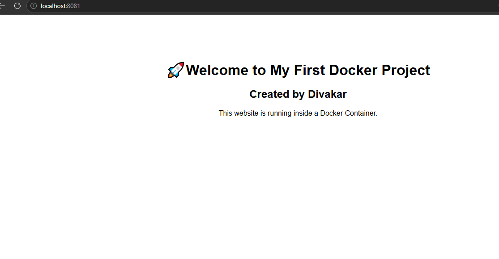

# Docker Static Website

This is my first Docker project.

## Technologies

- Docker
- Nginx
- HTML

## Project Structure

```text
docker-static-website/
│── images/
│── Dockerfile
│── index.html
│── README.md
```

## Screenshot



## Build

```bash
docker build -t my-first-website .
```

## Run

```bash
docker run -d -p 8081:80 --name website my-first-website
```

## Browser

```
http://localhost:8081
```
